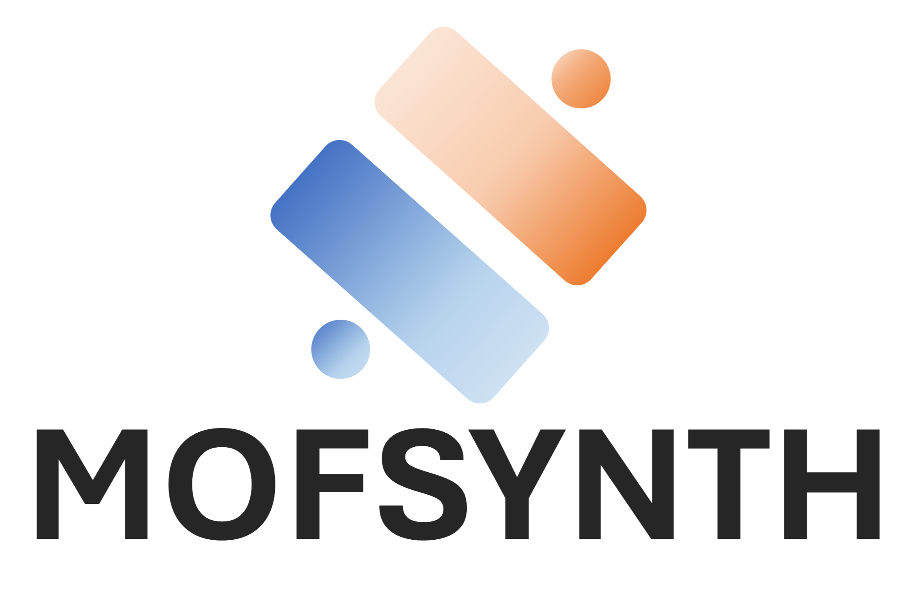

.. MOFsynth-QM documentation master file, created by
   sphinx-quickstart on Thu Jul 24 11:20:11 2025.

.. image:: https://readthedocs.org/projects/mofsynth_qm/badge/?version=latest
    :target: https://mofsynth_qm.readthedocs.io/en/latest/?badge=latest
    :alt: Documentation Status
    :align: center

.. _introduction:
🏠 Introduction
============

MOFSynth-QM is a Python package for MOF synthesizability evaluation, with emphasis on reticular chemistry.

We propose that disparities in energy and geometry between the linker conformation within the MOF structure
and its isolated, free gas state are critical factors influencing MOF synthesis.
Our user-friendly tool streamlines synthesizability evaluation, requiring minimal expertise in computational chemistry.

Why MOFSynth-QM?
----------

In materials science, especially in the synthesis of metal-organic frameworks,
a significant portion of time and effort is spent on the experimental process of synthesizing
and evaluating the viability of MOFs. This Python package streamlines this process,
significantly *reducing the time and effort* typically required for experimental preparation.
MOFSynth-QM allows researchers to *focus more on innovative synthesis and experimental validation*,
rather than on labor-intensive preliminary tasks. Its **user-friendly interface** and robust functionality
make it an invaluable resource for accelerating the discovery and development of new MOFs.

**All you need is your** ``.cif`` **!**

Objective
---------

MOFSynth-QM offers a quick and user-friendly interface to evaluate the synthesizability of MOFs,
enabling experimentalists to efficiently select the best candidates for a given application 
or even identify the most promising options from a vast database.

Citing MOFSynth-QM
------------

Please consider citing this publication: https://pubs.acs.org/doi/full/10.1021/acs.jcim.4c01298

License
-------
MOFsynth-QM is released under the `GNU General Public License v3.0 only <https://spdx.org/licenses/GPL-3.0-only.html>`_.

Contents
--------

.. toctree::
   :maxdepth: 1

   Home <self>
   installation
   tutorial
